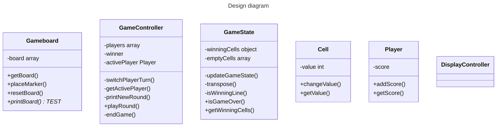

The goal of this project is to desing a Tic Tac Toe game that can be played in the browser.

The previous lesson taught me about factory functions and IIFE and I'm supposed to use them as much as possible to get some practice on this project.

To do:
- [ ] Make sure a cell is blocked after being played