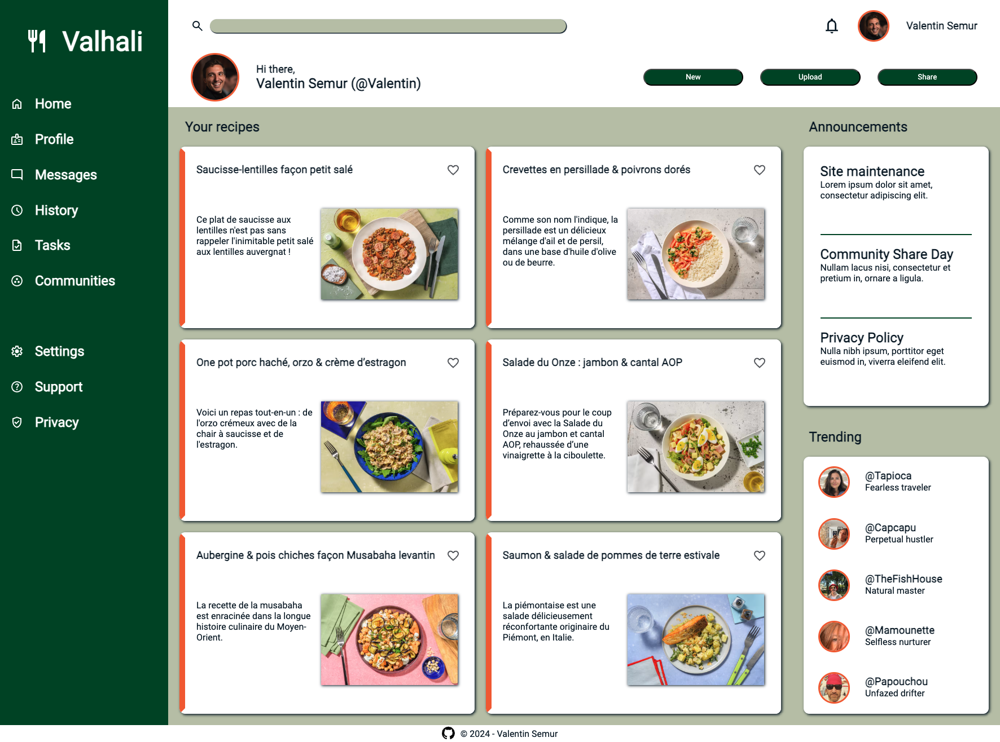

# Odin Projects

I'm currently following [The Odin Project (TOP)](https://www.theodinproject.com/).\
It is an open-source curriculum for learning full-stack web development.

Odin's creators/maintainers believe in learning by doing and so do I.\
Therefore, here are the projects I did while following the curriculum.

## Projects

### Top 3

#### [Admin Dashboard](https://valentin-semur.github.io/odin_projects/07_admin-dashboard/)
Responsive web page, created using only HTML and Vanilla CSS

#### [Calculator](https://valentin-semur.github.io/odin_projects/05_calculator/)
Fully functionnal calculator with keyboard support (not using eval()) 

#### [Etch-a-sketch](https://valentin-semur.github.io/odin_projects/04_etch-a-sketch/)
Pixel art board inspired by the old Etch-a-sketch

### Full project list
- [Recipes](https://valentin-semur.github.io/odin_projects/01_recipes/)
- [Landing page](https://valentin-semur.github.io/odin_projects/02_landing-page/)
- [Rock-paper-scissors](https://valentin-semur.github.io/odin_projects/03_rock-paper-scissors/)
- [Etch-a-sketch](https://valentin-semur.github.io/odin_projects/04_etch-a-sketch/)
- [Calculator](https://valentin-semur.github.io/odin_projects/05_calculator/)
- [Sign-up form](https://valentin-semur.github.io/odin_projects/06_sign-up-form/)
- [Admin dashboard](https://valentin-semur.github.io/odin_projects/07_admin-dashboard/)

